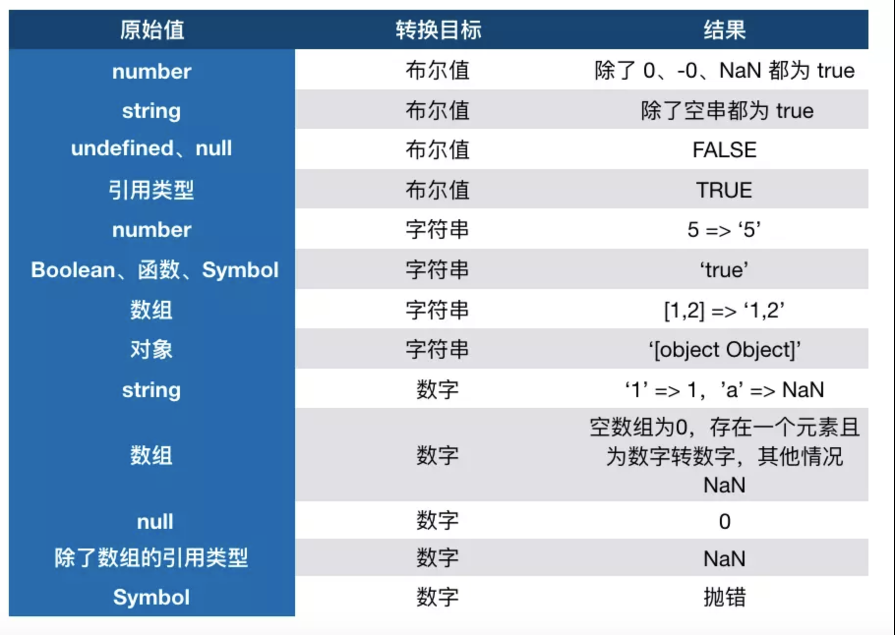
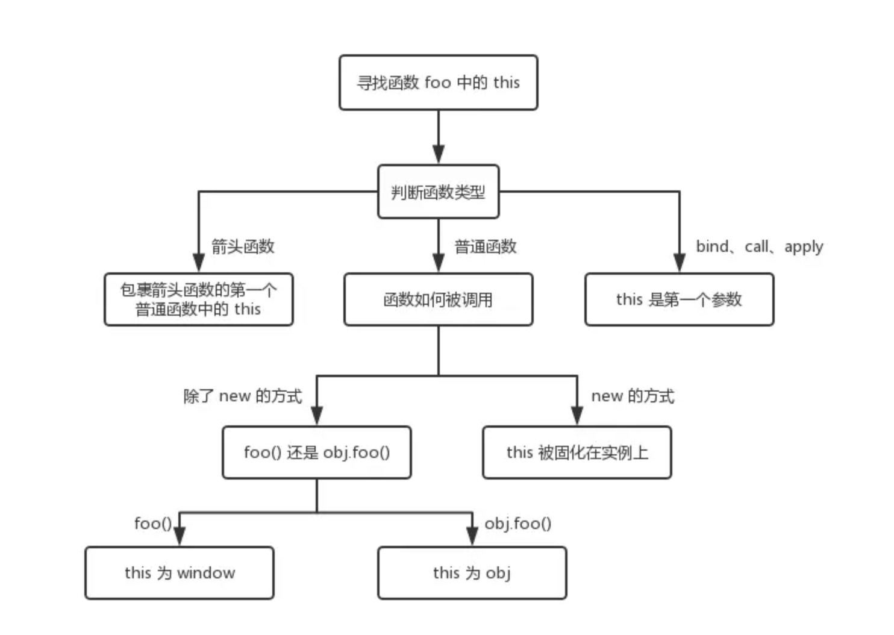
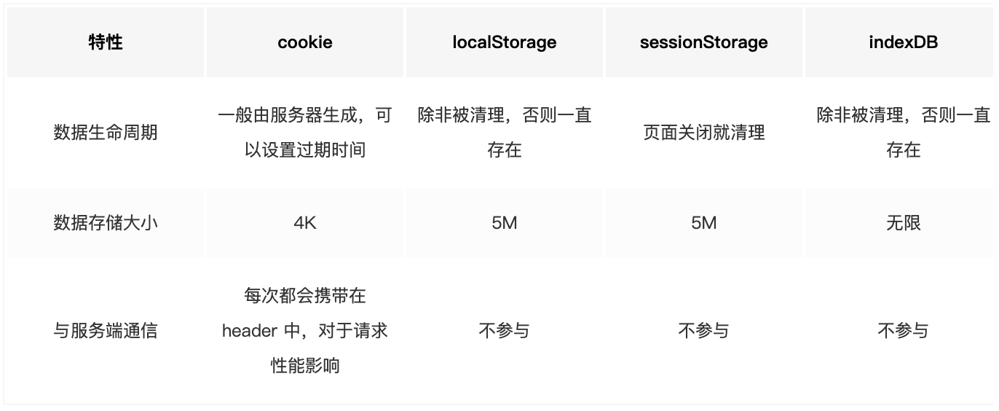
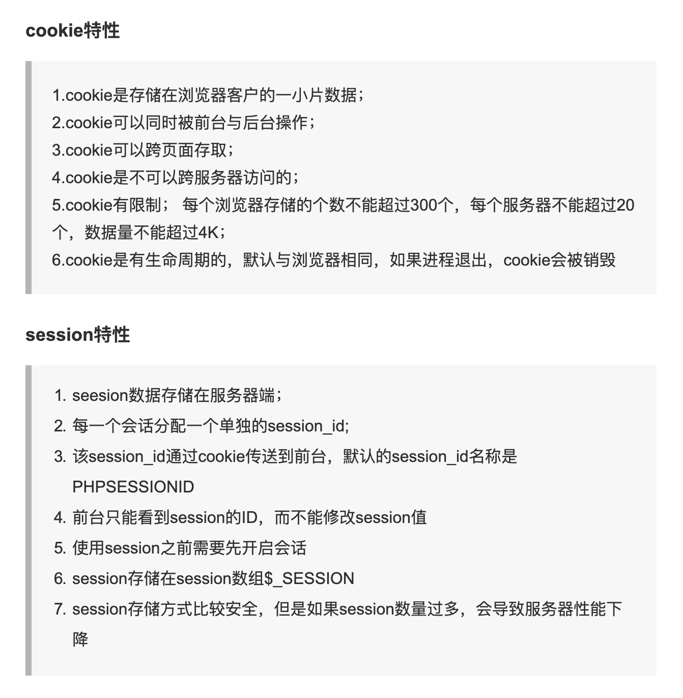

# 前端面试问题汇总

## 一、 JS 值的类型

### 原始类型

在 JS 中，存在着 6 种原始值，分别是：`null`、`undefind`、 `string`、 `number`、 `boolean`、 `symbol`。

原始类型存储的都是值，是没有函数可以调用的。

此时你肯定会有疑问，这不对呀，明明 `'1'.toString()` 是可以使用的。其实在这种情况下，`'1'` 已经不是原始类型了，而是被强制转换成了 String 类型也就是对象类型，所以可以调用 `toString` 函数。

除了会在必要的情况下强转类型以外，原始类型还有一些坑。

其中 JS 的 `number` 类型是浮点类型的，在使用中会遇到某些 Bug，比如 `0.1 + 0.2 !== 0.3`， `string` 类型是不可变的，无论你在 `string` 类型上调用何种方法，都不会对值有改变。

另外对于 `null` 来说，很多人会认为他是个对象类型，其实这是错误的。虽然 `typeof null` 会输出 `object` ，但是这只是 JS 存在的一个悠久 Bug。在 JS 的最初版本中使用的是 32 位系统，为了性能考虑使用低位存储变量的类型信息，000 开头代表是对象，然而 null 表示为全零，所以将它错误的判断为 `object` 。虽然现在的内部类型判断代码已经改变了，但是对于这个 Bug 却是一直流传下来。

### 引用类型（对象类型）

> 对象类型和原始类型的不同之处？函数参数是对象会发生什么问题？

在 JS 中，除了原始类型那么其他的都是对象类型了。对象类型和原始类型不同的是，原始类型存储的是值，对象类型存储的是地址（指针）。当你创建了一个对象类型的时候，计算机会在内存中帮我们开辟一个空间来存放值，但是我们需要找到这个空间，这个空间会拥有一个地址（指针）。

```js
function test(person) {
  person.age = 26;
  // 重新为 person 分配了一个对象
  person = {
    name: 'yyy',
    age: 30
  };

  return person;
}
const p1 = {
  name: 'yck',
  age: 25
};
const p2 = test(p1);
// p1 的 age 属性在函数中被修改
console.log(p1); // -> { name: 'yck', age: 26 }
// p2 是被 return 回来的一个新对象
console.log(p2); // -> { name: 'yyy', age: 30 }
```

## JS 中的 typeof vs instanceof

> typeof 是否能正确判断类型？instanceof 能正确判断对象的原理是什么？

`typeof` 对于原始类型来说，除了 `null` 都可以显示正确的类型

```js
typeof 1; // 'number'
typeof '1'; // 'string'
typeof undefined; // 'undefined'
typeof true; // 'boolean'
typeof Symbol(); // 'symbol'
```

`typeof` 对于对象来说，除了函数都会显示 `object` ，所以说 `typeof` 并不能准确判断变量到底是什么类型

```js
typeof []; // 'object'
typeof {}; // 'object'
typeof console.log; // 'function'
```

如果我们想判断一个对象的正确类型，这时候可以考虑使用 `instanceof` ，因为内部机制是通过原型链来判断的。

```js
const Person = function() {};
const p1 = new Person();
p1 instanceof Person; // true

var str = 'hello world';
str instanceof String; // false

var str1 = new String('hello world');
str1 instanceof String; // true
```

对于 **原始类型** 来说，你想直接通过 `instanceof` 来判断类型是不行的，当然我们还是有办法让 `instanceof` 判断原始类型的

```js
class PrimitiveString {
  static [Symbol.hasInstance](x) {
    return typeof x === 'string';
  }
}
console.log('hello world' instanceof PrimitiveString); // true
```

## JS 中的类型转换

> 该知识点常在笔试题中见到，熟悉了转换规则就不惧怕此类题目了。

首先我们要知道，在 JS 中类型转换只有三种情况，分别是：

- 转换为布尔值
- 转换为数字
- 转换为字符串

我们先来看一个类型转换表格，然后再进入正题



### 四则运算符

加法运算符不同于其他几个运算符，它有以下几个特点：

- 运算中其中一方为字符串，那么就会把另一方也转换为字符串
- 如果一方不是字符串或者数字，那么会将它转换为数字或者字符串

```js
1 + '1'; // '11'
true + true; // 2
4 + [1, 2, 3]; // "41,2,3"
```

另外对于加法还需要注意这个表达式 `'a' + + 'b'`

```js
// 'a' + ( + 'b' ) 括号内的看成一个表达式
'a' + +'b'; // -> "aNaN"
```

因为 `+ 'b'` 等于 `NaN` ，所以结果为 `"aNaN"`，你可能也会在一些代码中看到过 `+ '1'` 的形式来快速获取 `number` 类型。

那么对于 **除了加法的运算符** 来说，只要其中一方是数字，那么另一方就会被转为数字

```js
4 * '3'; // 12
4 * []; // 0
4 * [1, 2]; // NaN
```

## JS 中的 this 对象

> 如何正确判断 this？箭头函数的 this 是什么？

- `this` 总是指向函数的直接调用者（而非间接调用者）；
- 如果有 `new` 关键字， `this` 指向 `new` 出来的那个对象；
- 在事件中， `this` 指向触发这个事件的对象，特殊的是，IE 中的 attachEvent 中的 `this` 总是指向全局对象 `window` ；

```js
function a() {
  return () => {
    return () => {
      console.log(this);
    };
  };
}
console.log(a()()());
```

箭头函数其实是没有 `this` 的，**箭头函数中的 `this` 只取决包裹箭头函数的第一个普通函数的 `this`** 。在这个例子中，因为包裹箭头函数的第一个普通函数是 `a` ，所以此时的 `this` 是 `window` 。另外对箭头函数使用 `bind` 这类函数是无效的。

如果对一个函数进行多次 bind，那么上下文会是什么呢？

```js
let a = {};
let fn = function() {
  console.log(this);
};
fn.bind().bind(a)(); // => ?
```

可以从上述代码中发现，不管我们给函数 `bind` 几次， `fn` 中的 `this` 永远由第一次 `bind` 决定，所以结果永远是 `window` 。

以上就是 `this` 的规则了，但是可能会发生多个规则同时出现的情况，这时候不同的规则之间会根据优先级最高的来决定 `this` 最终指向哪里。

首先， `new` 的方式优先级最高，接下来是 `bind` 这些函数，然后是 `obj.foo()` 这种调用方式，最后是 `foo` 这种调用方式，同时，箭头函数的 `this` 一旦被绑定，就不会再被任何方式所改变。



## == 和 === 有什么区别？

对于 `==` 来说，如果对比双方的类型不一样的话，就会进行类型转换。

假如我们需要对比 `x` 和 `y` 是否相同，就会进行如下判断流程：

1. 首先会判断两者类型是否相同。相同的话就是比大小了
2. 类型不相同的话，那么就会进行类型转换
3. 会先判断是否在对比 `null` 和 `undefined` ，是的话就会返回 true
4. 判断两者类型是否为 `string` 和 `number` ，是的话就会将字符串转换为 `number`
   ```js
   1 == '1'
         ↓
   1 ==  1
   ```
5. 判断其中一方是否为 `boolean` ，是的话就会把 `boolean` 转为 `number` 再进行判断
   ```js
   '1' == true
           ↓
   '1' ==  1
           ↓
    1  ==  1
   ```
6. 判断其中一方是否为 object 且另一方为 string、number 或者 symbol，是的话就会把 object 转为原始类型再进行判断

   ```js
   '1' == { name: 'yck' }
           ↓
   '1' == '[object Object]'
   ```

> 看完了上面的步骤，对于 [] == ![] 你是否能正确写出答案呢？
>
> 步骤：1、 0 == false --> 2、 0 == 0
>
> 结果为：true

## JS 闭包函数及其应用场景

闭包的定义其实很简单：函数 A 内部有一个函数 B，函数 B 可以访问到函数 A 中的变量，那么函数 B 就是闭包。

```js
function A() {
  let a = 1;
  window.B = function() {
    console.log(a);
  };
}
A();
B(); // 1
```

很多人对于闭包的解释可能是函数嵌套了函数，然后返回一个函数。其实这个解释是不完整的，就比如我上面这个例子就可以反驳这个观点。

> 在 JS 中，闭包存在的意义就是让我们可以间接访问函数内部的变量。

### 经典面试题，循环中使用闭包解决 `var` 定义函数的问题

```js
for (var i = 1; i <= 5; i++) {
  setTimeout(function timer() {
    console.log(i);
  }, i * 1000);
}
```

首先因为 `setTimeout` 是个异步函数，所以会先把循环全部执行完毕，这时候 `i` 就是 `6` 了，所以会输出一堆 `6` 。

解决办法有三种，第一种是使用闭包的方式

```js
for (var i = 1; i <= 5; i++) {
  (function(j) {
    // 立即执行函数，可以看作函数A
    setTimeout(function timer() {
      // 函数B，访问了函数A的变量
      console.log(j);
    }, j * 1000);
  })(i);
}
```

在上述代码中，我们首先使用了立即执行函数将 `i` 传入函数内部，这个时候值就被固定在了参数 `j` 上面不会改变，当下次执行 `timer` 这个闭包的时候，就可以使用外部函数的变量 `j` ，从而达到目的。

第二种就是使用 `setTimeout` 的第三个参数，这个参数会被当成 `timer` 函数的参数传入。

```js
for (var i = 1; i <= 5; i++) {
  setTimeout(
    function timer(j) {
      console.log(j);
    },
    i * 1000,
    i
  );
}
```

第三种就是使用 let 定义 i 了来解决问题了，这个也是最为推荐的方式

```js
for (let i = 1; i <= 5; i++) {
  setTimeout(function timer() {
    console.log(i);
  }, i * 1000);
}
```

## JS 中的深浅拷贝

> 什么是浅拷贝？如何实现浅拷贝？什么是深拷贝？如何实现深拷贝？

我们了解了对象类型在赋值的过程中其实是复制了地址，从而会导致改变了一方其他也都被改变的情况。通常在开发中我们不希望出现这样的问题，我们可以使用浅拷贝来解决这个情况。

### 浅拷贝

首先可以通过 `Object.assign` 来解决这个问题，很多人认为这个函数是用来深拷贝的。其实并不是， `Object.assign` 只会拷贝所有的属性值到新的对象中，如果属性值是对象的话，拷贝的是地址，所以并不是深拷贝。

```js
let a = {
  age: 1
};
let b = Object.assign({}, a);
a.age = 2;
console.log(b.age); // 1
```

另外我们还可以通过展开运算符 `...` 来实现浅拷贝

```js
let a = {
  age: 1
};
let b = { ...a };
a.age = 2;
console.log(b.age); // 1
```

通常浅拷贝就能解决大部分问题了，但是当我们遇到如下情况就可能需要使用到深拷贝了

```js
let a = {
  age: 1,
  jobs: {
    first: 'FE'
  }
};
let b = { ...a };
a.jobs.first = 'native';
console.log(b.jobs.first); // native
```

浅拷贝只解决了第一层的问题，如果接下去的值中还有对象的话，那么就又回到最开始的话题了，两者享有相同的地址。要解决这个问题，我们就得使用深拷贝了。

### 深拷贝

这个问题通常可以通过 JSON.parse(JSON.stringify(object)) 来解决。

```js
let a = {
  age: 1,
  jobs: {
    first: 'FE'
  }
};
let b = JSON.parse(JSON.stringify(a));
a.jobs.first = 'native';
console.log(b.jobs.first); // FE
```

但是该方法也是有局限性的：

- 会忽略 `undefined`
- 会忽略 `symbol`
- 不能序列化函数
- 不能解决循环引用的对象

当然你可能想自己来实现一个深拷贝，但是其实实现一个深拷贝是很困难的，需要我们考虑好多种边界情况，比如原型链如何处理、DOM 如何处理等等，所以这里我们实现的深拷贝只是简易版，并且我其实更推荐使用 [lodash 的深拷贝函数](https://lodash.com/docs/4.17.11#cloneDeep)。

```js
function deepClone(obj) {
  function isObject(o) {
    return (typeof o === 'object' || typeof o === 'function') && o !== null;
  }

  if (!isObject(obj)) {
    throw new Error('非对象');
  }

  let isArray = Array.isArray(obj);
  let newObj = isArray ? [...obj] : { ...obj };
  Reflect.ownKeys(newObj).forEach(key => {
    newObj[key] = isObject(obj[key]) ? deepClone(obj[key]) : obj[key];
  });

  return newObj;
}

let obj = {
  a: [1, 2, 3],
  b: {
    c: 2,
    d: 3
  }
};
let newObj = deepClone(obj);
newObj.b.c = 1;
console.log(obj.b.c); // 2
```

## JS 中的原型、原型链

> 如何理解原型？如何理解原型链？

当我们创建一个对象时 `let obj = { age: 25 }` ，我们可以发现能使用很多种函数，但是我们明明没有定义过它们，对于这种情况你是否有过疑惑？

当我们在浏览器中打印 `obj` 时你会发现，在 `obj` 上居然还有一个 `__proto__` 属性。其实每个 JS 对象都有 `__proto__` 属性，这个属性指向了原型。

原型也是一个对象，并且这个对象中包含了很多函数，所以我们可以得出一个结论：对于 `obj` 来说，可以通过 `__proto__` 找到一个原型对象，在该对象中定义了很多函数让我们来使用。

在 `__proto__` 对象中还有一个 `constructor` 属性，也就是构造函数。打开 `constructor` 属性我们又可以发现其中还有一个 `prototype` 属性，并且这个属性对应的值和先前我们在 `__proto__` 中看到的一模一样。所以我们又可以得出一个结论：原型的 `constructor` 属性指向构造函数，构造函数又通过 `prototype` 属性指回原型，但是并不是所有函数都具有这个属性，`Function.prototype.bind()` 就没有这个属性。


总结起来就是以下几点：

- `Object` 是所有对象的爸爸，所有对象都可以通过 `__proto__` 找到它
- `Function` 是所有函数的爸爸，所有函数都可以通过 `__proto__` 找到它
- 函数的 `prototype` 是一个对象
- 对象的 `__proto__` 属性指向原型， `__proto__` 将对象和原型连接起来组成了原型链

### 经典面试题

```js
function Foo() {
  getName = function() {
    console.log(1);
  };
  return this;
}

Foo.getName = function() {
  console.log(2);
};

Foo.prototype.getName = function() {
  console.log(3);
};

var getName = function() {
  console.log(4);
};

function getName() {
  console.log(5);
}

Foo.getName(); // 2

getName(); // 4

Foo().getName(); // 1

getName(); // 1

new Foo.getName(); // 2

new Foo().getName(); // 3

new new Foo().getName(); // 3
```

## var、let 及 const 区别

> 什么是提升？什么是暂时性死区？var、let 及 const 区别？

```js
console.log(a); // undefined
var a = 1;
```

从上述代码中我们可以发现，虽然变量还没有被声明，但是我们却可以使用这个未被声明的变量，这种情况就叫做提升，并且提升的是声明。

对于这种情况，我们可以把代码这样来看

```js
var a;
console.log(a); // undefined
a = 1;
```

接下来我们再来看一个例子

```js
var a = 10;
var a;
console.log(a);
```

对于这个例子，如果你认为打印的值为 `undefined` 那么就错了，答案应该是 `10` ，对于这种情况，我们这样来看代码

```js
var a;
var a;
a = 10;
console.log(a);
```

到这里为止，我们已经了解了 `var` 声明的变量会发生提升的情况，其实不仅变量会提升函数也会被提升。

```js
console.log(a); // ƒ a() {}
function a() {}
var a = 1;
```

对于上述代码，打印结果会是 `ƒ a() {}`，即使变量声明在函数之后，这也说明了函数会被提升，并且优先于变量提升。

说完了这些，想必大家也知道 `var` 存在的问题了，使用 `var` 声明的变量会被提升到作用域的顶部。

我们再来看 let 和 const 的例子

```js
var a = 1;
let b = 1;
const c = 1;
console.log(window.b); // undefined
console.log(window.c); // undefined

function test() {
  console.log(a);
  let a;
}
test();
```

首先在全局作用域下使用 `let` 和 `const` 声明变量，变量并不会被挂载到 `window` 上，这一点就和 `var` 声明有了区别。

再者当我们在声明 `a` 之前如果使用了 `a` ，就会出现报错的情况。报错的原因是因为存在 **暂时性死区** ，我们不能在声明前就使用变量，这也是 `let` 和 `const` 优于 `var` 的一点。

总结一下：

- 函数提升优先于变量提升，函数提升会把整个函数挪到作用域顶部，变量提升只会把声明挪到作用域顶部
- var 存在提升，我们能在声明之前使用。let、const 因为暂时性死区的原因，不能在声明前使用
- var 在全局作用域下声明变量会导致变量挂载在 window 上，其他两者不会
- let 和 const 作用基本一致，但是后者声明的变量不能再次赋值

## 原型继承和 Class 继承

> 原型如何实现继承？Class 如何实现继承？Class 本质是什么？

首先先来讲下 `class` ，其实在 JS 中并不存在类， `class` 只是语法糖，本质还是函数。

```js
class Person {}
Person instanceof Function; // true
```

### 组合继承

组合继承是最常用的继承方式

```js
function Parent(value) {
  this.val = value;
}
Parent.prototype.getValue = function() {
  console.log(this.val);
};
function Child(value) {
  Parent.call(this, value); // 继承属性
}
Child.prototype = new Parent(); // 继承函数

const child = new Child(1);

child.getValue(); // 1
child instanceof Parent; // true
```

以上继承的方式核心是在子类的构造函数中通过 `Parent.call(this)` 继承父类的属性，然后改变子类的原型为 `new Parent()` 来继承父类的函数。

这种继承方式优点在于构造函数可以传参，不会与父类引用属性共享，可以复用父类的函数，但是也存在一个缺点就是在继承父类函数的时候调用了父类构造函数，导致子类的原型上多了不需要的父类属性，存在内存上的浪费。

### 寄生组合继承

这种继承方式对组合继承进行了优化，组合继承缺点在于继承父类函数时调用了构造函数，我们只需要优化掉这点就行了。

```js
function Parent(value) {
  this.val = value;
}
Parent.prototype.getValue = function() {
  console.log(this.val);
};

function Child(value) {
  Parent.call(this, value);
}
Child.prototype = Object.create(Parent.prototype, {
  constructor: {
    value: Child,
    enumerable: false,
    writable: true,
    configurable: true
  }
});

const child = new Child(1);

child.getValue(); // 1
child instanceof Parent; // true
```

以上继承实现的核心就是将父类的原型赋值给了子类，并且将构造函数设置为子类，这样既解决了无用的父类属性问题，还能正确的找到子类的构造函数。

## Class 继承

以上两种继承方式都是通过原型去解决的，在 ES6 中，我们可以使用 `class` 去实现继承，并且实现起来很简单

```js
class Parent {
  constructor(value) {
    this.val = value;
  }
  getValue() {
    console.log(this.val);
  }
}
class Child extends Parent {
  constructor(value) {
    super(value);
    this.val = value;
  }
}
let child = new Child(1);
child.getValue(); // 1
child instanceof Parent; // true
```

`class` 实现继承的核心在于使用 `extends` 表明继承自哪个父类，并且在子类构造函数中必须调用 `super` ，因为这段代码可以看成 `Parent.call(this, value)`。

当然了，之前也说了在 JS 中并不存在类， `class` 的本质就是函数。

## 模块化

> 为什么要使用模块化？都有哪几种方式可以实现模块化，各有什么特点？

使用模块化可以给我们带来以下好处

- 解决命名冲突
- 提供复用性
- 提高代码可维护性

### 立即执行函数

在早期，使用立即执行函数实现模块化是常见的手段，通过函数作用域解决了命名冲突、污染全局作用域的问题

```js
(function(globalVariable) {
  globalVariable.test = function() {};
  // ... 声明各种变量、函数都不会污染全局作用域
})(globalVariable);
```

### AMD 和 CMD

鉴于目前这两种实现方式已经很少见到，所以不再对具体特性细聊，只需要了解这两者是如何使用的。

```js
// AMD
define(['./a', './b'], function(a, b) {
  // 加载模块完毕可以使用
  a.do();
  b.do();
});
// CMD
define(function(require, exports, module) {
  // 加载模块
  // 可以把 require 写在函数体的任意地方实现延迟加载
  var a = require('./a');
  a.doSomething();
});
```

### CommonJS

CommonJS 最早是 Node 在使用，目前也仍然广泛使用，比如在 Webpack 中你就能见到它，当然目前在 Node 中的模块管理已经和 CommonJS 有一些区别了。

```js
// a.js
module.exports = {
  a: 1
};
// or
exports.a = 1;

// b.js
var module = require('./a.js');
module.a; // -> log 1
```

因为 CommonJS 还是会使用到的，所以这里会对一些疑难点进行解析

先说 `require` 吧

```js
var module = require('./a.js');
module.a;
// 这里其实就是包装了一层立即执行函数，这样就不会污染全局变量了，
// 重要的是 module 这里，module 是 Node 独有的一个变量
module.exports = {
  a: 1
};
// module 基本实现
var module = {
  id: 'xxxx', // 我总得知道怎么去找到他吧
  exports: {} // exports 就是个空对象
};
// 这个是为什么 exports 和 module.exports 用法相似的原因
var exports = module.exports;
var load = function(module) {
  // 导出的东西
  var a = 1;
  module.exports = a;
  return module.exports;
};
// 然后当我 require 的时候去找到独特的
// id，然后将要使用的东西用立即执行函数包装下，over
```

另外虽然 `exports` 和 `module.exports` 用法相似，但是不能对 `exports` 直接赋值。因为 `var exports = module.exports` 这句代码表明了 `exports` 和 `module.exports` 享有相同地址，通过改变对象的属性值会对两者都起效，但是如果直接对 `exports` 赋值就会导致两者不再指向同一个内存地址，修改并不会对 `module.exports` 起效。

### ES Module

ES Module 是原生实现的模块化方案，与 CommonJS 有以下几个区别

- CommonJS 支持动态导入，也就是 `require(${path}/xx.js)`，后者目前不支持，但是已有提案
- CommonJS 是同步导入，因为用于服务端，文件都在本地，同步导入即使卡住主线程影响也不大。而后者是异步导入，因为用于浏览器，需要下载文件，如果也采用同步导入会对渲染有很大影响
- CommonJS 在导出时都是值拷贝，就算导出的值变了，导入的值也不会改变，所以如果想更新值，必须重新导入一次。但是 ES Module 采用实时绑定的方式，导入导出的值都指向同一个内存地址，所以导入值会跟随导出值变化
- ES Module 会编译成 require/exports 来执行的

  ````js
  // 引入模块 API
  import XXX from './a.js'
  import { XXX } from './a.js'
  // 导出模块 API
  export function a() {}
  export default function() {}
  ```
  ````

## Proxy

> Proxy 可以实现什么功能？

在 Vue3.0 中将会通过 `Proxy` 来替换原本的 `Object.defineProperty` 来实现数据响应式。 `Proxy` 是 ES6 中新增的功能，它可以用来自定义对象中的操作。

```js
let p = new Proxy(target, handler);
```

`target` 代表需要添加代理的对象， `handler` 用来自定义对象中的操作，比如可以用来自定义 `set` 或者 `get` 函数。

之所以 Vue3.0 要使用 `Proxy` 替换原本的 API 原因在于 `Proxy` 无需一层层递归为每个属性添加代理，一次即可完成以上操作，性能上更好，并且原本的实现有一些数据更新不能监听到，但是 `Proxy` 可以完美监听到任何方式的数据改变，唯一缺陷可能就是浏览器的兼容性不好了。

## map, filter, reduce

> map, filter, reduce
> `map` 作用是生成一个新数组，遍历原数组，将每个元素拿出来做一些变换然后放入到新的数组中。

另外 `map` 的回调函数接受三个参数，分别是**当前索引元素**，**索引**，**原数组**

```js
['1', '2', '3'].map(parseInt);
```

- 第一轮遍历 parseInt('1', 0) -> 1
- 第二轮遍历 parseInt('2', 1) -> NaN
- 第三轮遍历 parseInt('3', 2) -> NaN

`filter` 的作用也是生成一个新数组，在遍历数组的时候将返回值为 `true` 的元素放入新数组，我们可以利用这个函数删除一些不需要的元素

```js
let array = [1, 2, 4, 6];
let newArray = array.filter(item => item !== 6);
console.log(newArray); // [1, 2, 4]
```

和 `map` 一样， `filter` 的回调函数也接受三个参数，用处也相同。

最后我们来讲解 `reduce` 这块的内容，同时也是最难理解的一块内容。 `reduce` 可以将数组中的元素通过回调函数最终转换为一个值。

如果我们想实现一个功能将函数里的元素全部相加得到一个值，可能会这样写代码

```js
const arr = [1, 2, 3];
let total = 0;
for (let i = 0; i < arr.length; i++) {
  total += arr[i];
}
console.log(total); //6
```

但是如果我们使用 `reduce` 的话就可以将遍历部分的代码优化为一行代码

```js
const arr = [1, 2, 3];
const sum = arr.reduce((acc, current) => acc + current, 0);
console.log(sum);
```

对于 `reduce` 来说，它接受两个参数，分别是回调函数和初始值，接下来我们来分解上述代码中 `reduce` 的过程

- 首先初始值为 0，该值会在执行第一次回调函数时作为第一个参数传入
- 回调函数接受四个参数，分别为累计值、当前元素、当前索引、原数组，后三者想必大家都可以明白作用，这里着重分析第一个参数
- 在一次执行回调函数时，当前值和初始值相加得出结果 1，该结果会在第二次执行回调函数时当做第一个参数传入
- 所以在第二次执行回调函数时，相加的值就分别是 1 和 2，以此类推，循环结束后得到结果 6

想必通过以上的解析大家应该明白 `reduce` 是如何通过回调函数将所有元素最终转换为一个值的，当然 `reduce` 还可以实现很多功能，接下来我们就通过 `reduce` 来实现 `map` 函数

```js
const arr = [1, 2, 3];
const mapArray = arr.map(value => value * 2);
const reduceArray = arr.reduce((acc, current) => {
  acc.push(current * 2);
  return acc;
}, []);
console.log(mapArray, reduceArray); // [2, 4, 6]
```

## 回调函数（Callback）

> 什么是回调函数？回调函数有什么缺点？如何解决回调地狱问题？

回调函数应该是大家经常使用到的，以下代码就是一个回调函数的例子：

```js
ajax(url, () => {
  // 处理逻辑
});
```

但是回调函数有一个致命的弱点，就是容易写出回调地狱（Callback hell）。假设多个请求存在依赖性，你可能就会写出如下代码：

```js
ajax(url, () => {
  // 处理逻辑
  ajax(url1, () => {
    // 处理逻辑
    ajax(url2, () => {
      // 处理逻辑
    });
  });
});
```

回调地狱的根本问题就是：

- 嵌套函数存在耦合性，一旦有所改动，就会牵一发而动全身
- 嵌套函数一多，就很难处理错误

当然，回调函数还存在着别的几个缺点，比如不能使用 `try catch` 捕获错误，不能直接 `return` 。

## Promise

> Promise 的特点是什么，分别有什么优缺点？什么是 Promise 链？Promise 构造函数执行和 then 函数执行有什么区别？

`Promise` 翻译过来就是承诺的意思，这个承诺会在未来有一个确切的答复，并且该承诺有三种状态，分别是：

1. 等待中（pending）
2. 完成了（resolved）
3. 拒绝了（rejected）
   这个承诺一旦从等待状态变成为其他状态就永远不能更改状态了，也就是说一旦状态变为 resolved 后，就不能再次改变

```js
new Promise((resolve, reject) => {
  resolve('success');
  // 无效
  reject('reject');
});
```

当我们在构造 `Promise` 的时候，构造函数内部的代码是立即执行的

```js
new Promise((resolve, reject) => {
  console.log('new Promise');
  resolve('success');
});
console.log('finifsh');
// new Promise -> finifsh
```

`Promise` 实现了链式调用，也就是说每次调用 `then` 之后返回的都是一个 `Promise` ，并且是一个全新的 `Promise` ，原因也是因为状态不可变。如果你在 `then` 中 使用了 `return` ，那么 `return` 的值会被 `Promise.resolve()` 包装

```js
Promise.resolve(1)
  .then(res => {
    console.log(res); // => 1
    return 2; // 包装成 Promise.resolve(2)
  })
  .then(res => {
    console.log(res); // => 2
  });
```

当然了， `Promise` 也很好地解决了回调地狱的问题，可以把之前的回调地狱例子改写为如下代码：

```js
ajax(url)
  .then(res => {
    console.log(res);
    return ajax(url1);
  })
  .then(res => {
    console.log(res);
    return ajax(url2);
  })
  .then(res => console.log(res));
```

`Promise.all` 可以将多个 `Promise` 实例包装成一个新的 `Promise` 实例。同时，成功和失败的返回值是不同的，**成功的时候返回的是一个结果数组，而失败的时候则返回最先被 `reject` 失败状态的值**。

```js
let p1 = new Promise((resolve, reject) => {
  resolve('成功了');
});

let p2 = new Promise((resolve, reject) => {
  resolve('success');
});

let p3 = Promise.reject('失败了');

let p4 = Promise.reject('fail');

Promise.all([p1, p2])
  .then(result => {
    console.log(result); //['成功了', 'success']
  })
  .catch(error => {
    console.log(error);
  });

Promise.all([p1, p3, p2, p4])
  .then(result => {
    console.log(result);
  })
  .catch(error => {
    console.log(error); // 失败了，打出 '失败了'
  });
```

`Promse.all` 在处理多个异步处理时非常有用，比如说一个页面上需要等两个或多个 `ajax` 的数据回来以后才正常显示，在此之前只显示 `loading` 图标。

```js
let wake = time => {
  return new Promise((resolve, reject) => {
    setTimeout(() => {
      resolve(`${time / 1000}秒后醒来`);
    }, time);
  });
};

let p1 = wake(3000);
let p2 = wake(2000);

Promise.all([p1, p2])
  .then(result => {
    console.log(result); // [ '3秒后醒来', '2秒后醒来' ]
  })
  .catch(error => {
    console.log(error);
  });
```

需要特别注意的是， `Promise.all` 获得的成功结果的数组里面的数据顺序和 `Promise.all` 接收到的数组顺序是一致的，即 `p1` 的结果在前，即便 `p1` 的结果获取的比 `p2` 要晚。这带来了一个绝大的好处：在前端开发请求数据的过程中，偶尔会遇到发送多个请求并根据请求顺序获取和使用数据的场景，使用 `Promise.all` 毫无疑问可以解决这个问题。

前面都是在讲述 `Promise` 的一些优点和特点，其实它也是存在一些缺点的，比如无法取消 `Promise` ，错误需要通过回调函数捕获。

## async 及 await

> async 及 await 的特点，它们的优点和缺点分别是什么？await 原理是什么？

一个函数如果加上 `async` ，那么该函数就会返回一个 `Promise`

```js
async function test() {
  return '1';
}
console.log(test()); // -> Promise {<resolved>: "1"}
```

`async` 就是将函数返回值使用 `Promise.resolve()` 包裹了下，和 `then` 中处理返回值一样，并且 `await` 只能配套 `async` 使用

```js
async function test() {
  let value = await sleep();
}
```

`async` 和 `await` 可以说是异步终极解决方案了，相比直接使用 `Promise` 来说，优势在于处理 `then` 的调用链，能够更清晰准确的写出代码，毕竟写一大堆 `then` 也很恶心，并且也能优雅地解决回调地狱问题。当然也存在一些缺点，因为 `await` 将异步代码改造成了同步代码，如果多个异步代码没有依赖性却使用了 `await` 会导致性能上的降低。

```js
async function test() {
  // 以下代码没有依赖性的话，完全可以使用 Promise.all 的方式
  // 如果有依赖性的话，其实就是解决回调地狱的例子了
  await fetch(url);
  await fetch(url1);
  await fetch(url2);
}
```

下面来看一个使用 `await` 的例子：

```js
let a = 0;
let b = async () => {
  a = a + (await 10);
  console.log('2', a); // -> '2' 10
};
b();
a++;
console.log('1', a); // -> '1' 1
```

对于以上代码你可能会有疑惑，让我来解释下原因

首先函数 `b` 先执行，在执行到 `await 1`0 之前变量 `a` 还是 `0` ，因为 `await` 内部实现了 `generator` ， `generator` 会保留堆栈中东西，所以这时候 `a = 0` 被保存了下来
因为 `await` 是异步操作，后来的表达式不返回 `Promise` 的话，就会包装成 `Promise.reslove(返回值)` ，然后会去执行函数外的同步代码
同步代码执行完毕后开始执行异步代码，将保存下来的值拿出来使用，这时候 `a = 0 + 10`

## 常用定时器函数

> setTimeout、setInterval、requestAnimationFrame 各有什么特点？

异步编程当然少不了定时器了，常见的定时器函数有 `setTimeout` 、 `setInterval` 、 `requestAnimationFrame` 。我们先来讲讲最常用的 `setTimeout` ，很多人认为 `setTimeout` 是延时多久，那就应该是多久后执行。

其实这个观点是错误的，因为 JS 是单线程执行的，如果前面的代码影响了性能，就会导致 `setTimeout` 不会按期执行。当然了，我们可以通过代码去修正 `setTimeout` ，从而使定时器相对准确

接下来我们来看 `setInterval` ，其实这个函数作用和 `setTimeout` 基本一致，只是该函数是每隔一段时间执行一次回调函数。

通常来说不建议使用 `setInterval` 。第一，它和 `setTimeout` 一样，不能保证在预期的时间执行任务。第二，它存在执行累积的问题，请看以下伪代码

```js
function demo() {
  setInterval(function() {
    console.log(2);
  }, 1000);
  sleep(2000);
}
demo();
```

以上代码在浏览器环境中，如果定时器执行过程中出现了耗时操作，多个回调函数会在耗时操作结束以后同时执行，这样可能就会带来性能上的问题。

如果你有循环定时器的需求，其实完全可以通过 `requestAnimationFrame` 来实现

```js
function setInterval(callback, interval) {
  let timer;
  const now = Date.now;
  let startTime = now();
  let endTime = startTime;
  const loop = () => {
    timer = window.requestAnimationFrame(loop);
    endTime = now();
    if (endTime - startTime >= interval) {
      startTime = endTime = now();
      callback(timer);
    }
  };
  timer = window.requestAnimationFrame(loop);
  return timer;
}

let a = 0;
setInterval(timer => {
  console.log(1);
  a++;
  if (a === 3) cancelAnimationFrame(timer);
}, 1000);
```

首先 `requestAnimationFrame` 自带函数节流功能，基本可以保证在 16.6 毫秒内只执行一次（不掉帧的情况下），并且该函数的延时效果是精确的，没有其他定时器时间不准的问题，当然你也可以通过该函数来实现 `setTimeout` 。

## new

> new 的原理是什么？通过 new 的方式创建对象和通过字面量创建有什么区别？

在调用 `new` 的过程中会发生以上四件事情：

1. 创建一个新对象：

`var obj = {};`

2. 设置新对象的 constructor 属性为构造函数的名称，设置新对象的**proto**属性指向构造函数的 prototype 对象；

`obj.__proto__ = ClassA.prototype;`

3. 使用新对象调用函数，函数中的 this 被指向新实例对象：

`ClassA.call(obj); //{}.构造函数()`

4. 将初始化完毕的新对象地址，保存到等号左边的变量中

> 注意：若构造函数中返回 this 或返回值是基本类型（number、string、boolean、null、undefined）的值，则返回新实例对象；若返回值是引用类型的值，则实际返回值为这个引用类型。

对于对象来说，其实都是通过 `new` 产生的，无论是 `function Foo()` 还是 `let a = { b : 1 }` 。

对于创建一个对象来说，更推荐使用字面量的方式创建对象（无论性能上还是可读性）。因为你使用 `new Object()` 的方式创建对象需要通过作用域链一层层找到 `Object` ，但是你使用字面量的方式就没这个问题。

```js
function Foo() {}
// function 就是个语法糖
// 内部等同于 new Function()
let a = { b: 1 };
// 这个字面量内部也是使用了 new Object()
```

## instanceof 的原理

`instanceof` 可以正确的判断对象的类型，因为内部机制是通过判断对象的原型链中是不是能找到类型的 `prototype` 。

## 事件机制

> 事件的触发过程是怎么样的？知道什么是事件代理吗？

### 事件触发三阶段

事件触发有三个阶段：

1. window 往事件触发处传播，遇到注册的捕获事件会触发
2. 传播到事件触发处时触发注册的事件
3. 从事件触发处往 window 传播，遇到注册的冒泡事件会触发

事件触发一般来说会按照上面的顺序进行，但是也有特例，如果给一个 `body` 中的子节点同时注册冒泡和捕获事件，事件触发会按照注册的顺序执行。

```js
// 以下会先打印冒泡然后是捕获
node.addEventListener(
  'click',
  event => {
    console.log('冒泡');
  },
  false
);
node.addEventListener(
  'click',
  event => {
    console.log('捕获 ');
  },
  true
);
```

### 注册事件

通常我们使用 `addEventListener` 注册事件，该函数的第三个参数可以是布尔值，也可以是对象。对于布尔值 `useCapture` 参数来说，该参数默认值为 `false` `，useCapture` 决定了注册的事件是捕获事件还是冒泡事件。对于对象参数来说，可以使用以下几个属性

- `capture` ：布尔值，和 `useCapture` 作用一样
- `once` ：布尔值，值为 `true` 表示该回调只会调用一次，调用后会移除监听
- `passive` ：布尔值，表示永远不会调用 `preventDefault`

一般来说，如果我们只希望事件只触发在目标上，这时候可以使用 `stopPropagation` 来阻止事件的进一步传播。通常我们认为 `stopPropagation` 是用来阻止事件冒泡的，其实该函数也可以阻止捕获事件。 `stopImmediatePropagation` 同样也能实现阻止事件，但是还能阻止该事件目标执行别的注册事件。

```js
node.addEventListener(
  'click',
  event => {
    event.stopImmediatePropagation();
    console.log('冒泡');
  },
  false
);
// 点击 node 只会执行上面的函数，该函数不会执行
node.addEventListener(
  'click',
  event => {
    console.log('捕获 ');
  },
  true
);
```

### 事件代理

如果一个节点中的子节点是动态生成的，那么子节点需要注册事件的话应该注册在父节点上

```html
<ul id="ul">
  <li>1</li>
  <li>2</li>
  <li>3</li>
  <li>4</li>
  <li>5</li>
</ul>
<script>
  let ul = document.querySelector('#ul');
  ul.addEventListener('click', event => {
    console.log(event.target);
  });
</script>
```

事件代理的方式相较于直接给目标注册事件来说，有以下优点：

- 节省内存
- 不需要给子节点注销事件

## 跨域

> 什么是跨域？为什么浏览器要使用同源策略？你有几种方式可以解决跨域问题？了解预检请求嘛？

因为浏览器出于安全考虑，有**同源策略**。也就是说，如果协议、域名或者端口有一个不同就是跨域，Ajax 请求会失败。

**那么是出于什么安全考虑才会引入这种机制呢？** 其实主要是用来防止 CSRF 攻击的。简单点说，CSRF 攻击是利用用户的登录态发起恶意请求。

**然后我们来考虑一个问题，请求跨域了，那么请求到底发出去没有？** 请求必然是发出去了，但是浏览器 **拦截了响应** 。你可能会疑问明明通过表单的方式可以发起跨域请求，为什么 Ajax 就不会。因为归根结底，跨域是为了阻止用户读取到另一个域名下的内容，Ajax 可以获取响应，**浏览器认为这不安全，所以拦截了响应**。但是表单并不会获取新的内容，所以可以发起跨域请求。同时也说明了跨域并不能完全阻止 CSRF，因为请求毕竟是发出去了。

### JSONP

JSONP 的原理很简单，就是利用 `<script>` 标签没有跨域限制的漏洞。通过 `<script>` 标签指向一个需要访问的地址并提供一个回调函数来接收数据。

```html
<!DOCTYPE html>
<html>
  <head>
    <title>GoJSONP</title>
  </head>
  <body>
    <script type="text/javascript">
      // 定义回调函数
      function jsonhandle(data) {
        alert('age:' + data.age + 'name:' + data.name);
      }
    </script>
    <script type="text/javascript" src="jquery-1.8.3.min.js"></script>
    <script
      type="text/javascript"
      src="http://www.practice-zhao.com/remote.js"
    ></script>
  </body>
</html>
```

这里调用了跨域的 remote.js 脚本，remote.js 代码如下：

```javascript
jsonhandle({
  age: 15,
  name: 'John'
});
```

**这段远程的 js 代码执行了上面定义的函数，弹出了提示框**

**JSONP 只能执行 `get` 方法，因为 script 引用的资源请求方式只能是 `get` 方法**

在开发中可能会遇到多个 `JSONP` 请求的回调函数名是相同的，这时候就需要自己封装一个 `JSONP` ，以下是简单实现

```js
function jsonp(url, jsonpCallback, success) {
  let script = document.createElement('script');
  script.src = url;
  script.async = true;
  script.type = 'text/javascript';
  window[jsonpCallback] = function(data) {
    success && success(data);
  };
  document.body.appendChild(script);
}
jsonp('http://xxx', 'callback', function(value) {
  console.log(value);
});
```

### CORS

`CORS` 需要浏览器和后端同时支持。IE 8 和 9 需要通过 `XDomainRequest` 来实现。

浏览器会自动进行 `CORS` 通信，实现 `CORS` 通信的关键是后端。只要后端实现了 `CORS` ，就实现了跨域。

服务端设置 `Access-Control-Allow-Origin` 就可以开启 `CORS` 。 该属性表示哪些域名可以访问资源，如果设置通配符则表示所有网站都可以访问资源。

## 存储

> 有几种方式可以实现存储功能，分别有什么优缺点？

### cookie，localStorage，sessionStorage，indexDB



从上表可以看到， `cookie` 已经不建议用于存储。如果没有大量数据存储需求的话，可以使用 `localStorage` 和 `sessionStorage` 。对于不怎么改变的数据尽量使用 `localStorage` 存储，否则可以用 `sessionStorage` 存储。

## 创建 Ajax 的过程

1. 创建 XMLHttpRequest 对象，也就是创建一个异步调用对象
2. 创建一个新的 HTTP 请求，并指定改 HTTP 请求的方法、URL 以及验证信息
3. 设置响应 HTTP 状态变化的函数
4. 发送 HTTP 请求
5. 获取异步调用返回的数据
6. 使用 javascript 和 DOM 实现局部刷新

```html
<html>
  <head>
    <meta http-equiv="Content-Type" content="text/html; charset=utf-8" />
    <title>AJAX实例</title>
    <script language="javascript" type="text/javascript">
      var xmlHttpRequest; //定义一个变量用于存放XMLHttpRequest对象
      //定义一个用于创建XMLHttpRequest对象的函数
      function createXMLHttpRequest() {
        if (window.ActiveXObject) {
          //IE浏览器的创建方式
          xmlHttpRequest = new ActiveXObject('Microsoft.XMLHTTP');
        } else if (window.XMLHttpRequest) {
          //Netscape浏览器中的创建方式
          xmlHttpRequest = new XMLHttpRequest();
        }
      }

      //响应HTTP请求状态变化的函数
      function httpStateChange() {
        //判断异步调用是否完成
        if (xmlHttpRequest.readyState == 4) {
          //判断异步调用是否成功,如果成功开始局部更新数据
          if (xmlHttpRequest.status == 200 || xmlHttpRequest.status == 0) {
            //查找节点
            var node = document.getElementById('myDIv'); //更新数据
            node.firstChild.nodeValue = xmlHttpRequest.responseText;
          } else {
            //如果异步调用未成功,弹出警告框,并显示出错信息
            alert(
              '异步调用出错/n返回的HTTP状态码为:' +
                xmlHttpRequest.status +
                '/n返回的HTTP状态信息为:' +
                xmlHttpRequest.statusText
            );
          }
        }
      }
      //异步调用服务器段数据
      function getData(name, value) {
        //创建XMLHttpRequest对象
        createXMLHttpRequest();
        if (xmlHttpRequest != null) {
          //创建HTTP请求
          xmlHttpRequest.open('get', 'ajax.text', true);
          //设置HTTP请求状态变化的函数
          xmlHttpRequest.onreadystatechange = httpStateChange;
          //发送请求
          xmlHttpRequest.send(null);
        }
      }
    </script>
  </head>
  <body>
    <div id="myDiv">原数据</div>

    <input type="button" value="更新数据" onclick="getData()" />
  </body>
</html>
```

## 输入 URL 到页面渲染的整个流程

1. 浏览器会开启一个线程来处理这个请求，对 URL 分析判断如果是 http 协议就按照 Web 方式来处理;
2. 调用浏览器内核中的对应方法，比如 WebView 中的 loadUrl 方法;
3. 通过 DNS 解析获取网址的 IP 地址，设置 UA 等信息发出第二个 GET 请求;
4. 进行 HTTP 协议会话，客户端发送报头(请求报头);
5. 进入到 web 服务器上的 Web Server，如 Apache、Tomcat、Node.JS 等服务器;
6. 进入部署好的后端应用，如 PHP、Java、JavaScript、Python 等，找到对应的请求处理;
7. 处理结束回馈报头，此处如果浏览器访问过，缓存上有对应资源，会与服务器最后修改时间对比，一致则返回 304;
8. 浏览器开始下载 html 文档(响应报头，状态码 200)，同时使用缓存;
9. 文档树建立，根据标记请求所需指定 MIME 类型的文件（比如 css、js）,同时设置了 cookie;
10. 页面开始渲染 DOM，JS 根据 DOM API 操作 DOM,执行事件绑定等，页面显示完成。

## JS 中的作用域、作用域链

### 作用域

作用域是指程序源代码中定义变量的区域。

作用域规定了如何查找变量，也就是确定当前执行代码对变量的访问权限。

JavaScript 采用词法作用域(lexical scoping)，也就是静态作用域。

### 静态作用域与动态作用域

因为 JavaScript 采用的是词法作用域，函数的作用域在函数定义的时候就决定了。

而与词法作用域相对的是动态作用域，函数的作用域是在函数调用的时候才决定的。

让我们认真看个例子就能明白之间的区别：

```js
var value = 1;

function foo() {
  console.log(value);
}

function bar() {
  var value = 2;
  foo();
}

bar();

// 结果是 1
```

JavaScript 采用静态作用域，让我们分析下执行过程：

执行 `foo` 函数，先从 `foo` 函数内部查找是否有局部变量 `value` ，如果没有，就根据书写的位置，查找上面一层的代码，也就是 `value` 等于 `1` ，所以结果会打印 `1` 。

### 作用域链

全局函数无法查看局部函数的内部细节，但局部函数可以查看其上层的函数细节，直至全局细节。当需要从局部函数查找某一属性或方法时，如果当前作用域没有找到，就会上溯到上层作用域查找，直至全局函数，这种组织形式就是作用域链。

## Session 与 Cookie 的区别



## http 状态码

- 100 Continue 继续，一般在发送 post 请求时，已发送了 http header 之后服务端将返回此信息，表示确认，之后发送具体参数信息
- 200 OK 正常返回信息
- 201 Created 请求成功并且服务器创建了新的资源
- 202 Accepted 服务器已接受请求，但尚未处理
- 301 Moved Permanently 请求的网页已永久移动到新位置。
- 302 Found 临时性重定向。
- 303 See Other 临时性重定向，且总是使用 GET 请求新的 URI。
- 304 Not Modified 自从上次请求后，请求的网页未修改过。
- 400 Bad Request 服务器无法理解请求的格式，客户端不应当尝试再次使用相同的内容发起请求。
- 401 Unauthorized 请求未授权。
- 403 Forbidden 禁止访问。
- 404 Not Found 找不到如何与 URI 相匹配的资源。
- 500 Internal Server Error 最常见的服务器端错误。
- 502 - 网关错误
- 503 Service Unavailable 服务器端暂时无法处理请求（可能是过载或维护）。

## 常见的浏览器内核

- Trident 内核：IE,MaxThon,TT,The World,360,搜狗浏览器等。（又称 MSHTML）
- Gecko 内核：Netscape6 及以上版本，FF,MozillaSuite/SeaMonkey 等
- Presto 内核：Opera7 及以上。（Opera 内核原为：Presto，现为：Blink;）
- Webkit 内核：Safari,Chrome 等。（Chrome 的：Blink（WebKit 的分支））

## 冒泡排序

- 比较相邻的元素。如果第一个比第二个大，就交换它们两个；
- 对每一对相邻元素作同样的工作，从开始第一对到结尾的最后一对，这样在最后的元素应该会是最大的数；
- 针对所有的元素重复以上的步骤，除了最后一个；
- 重复步骤 1~3，直到排序完成。

## 选择排序

- 在未排序序列中找到最小（大）元素，存放到排序序列的起始位置
- 从剩余未排序元素中继续寻找最小（大）元素，然后放到已排序序列的末尾
- 以此类推，直到所有元素均排序完毕。

```javascript
function selectionSort(arr) {
  var len = arr.length;
  var minIndex, temp;
  console.time('选择排序耗时');
  for (var i = 0; i < len - 1; i++) {
    minIndex = i;
    for (var j = i + 1; j < len; j++) {
      if (arr[j] < arr[minIndex]) {
        //寻找最小的数
        minIndex = j; //将最小数的索引保存
      }
    }
    temp = arr[i];
    arr[i] = arr[minIndex];
    arr[minIndex] = temp;
  }
  console.timeEnd('选择排序耗时');
  return arr;
}
var arr = [3, 44, 38, 5, 47, 15, 36, 26, 27, 2, 46, 4, 19, 50, 48];
console.log(selectionSort(arr)); //[2, 3, 4, 5, 15, 19, 26, 27, 36, 38, 44, 46, 47, 48, 50]
```

## 插入排序

- 从第一个元素开始，该元素可以认为已经被排序；
- 取出下一个元素，在已经排序的元素序列中从后向前扫描；
- 如果该元素（已排序）大于新元素，将该元素移到下一位置；
- 重复步骤 3，直到找到已排序的元素小于或者等于新元素的位置；
- 将新元素插入到该位置后；
- 重复步骤 2~5。

## 快速排序

- 从数列中挑出一个元素，称为 "基准"（pivot）；
- 重新排序数列，所有元素比基准值小的摆放在基准前面，所有元素比基准值大的摆在基准的后面（相同的数可以到任一边）。在这个分区退出之后，该基准就处于数列的中间位置。这个称为分区（partition）操作；
- 递归地（recursive）把小于基准值元素的子数列和大于基准值元素的子数列排序。

## 移动端 viewport

```javascript
<meta name="viewport" content="width=device-width, initial-scale=1.0, maximum-scale=1.0, user-scalable=0">
```

## 媒体查询

```javascript
@media (max-width: 767px) { ...css代码... }
@media (min-width: 768px) and (max-width: 991px) { ...css代码... }
@media (min-width: 992px) and (max-width: 1199px) { ...css代码... }
@media (min-width: 1200px) { ...css代码... }
```

> vw —— 视口宽度的 1/100；vh —— 视口高度的 1/100

## 多行省略

```css
<style>
div
{
    width:400px;
    margin:0 auto;
    overflow : hidden;
    border:1px solid #ccc;
    text-overflow: ellipsis;
    padding:0 10px;
    display: -webkit-box;
    -webkit-line-clamp: 2;
    -webkit-box-orient: vertical;
    line-height:30px;
    height:60px;
}
</style>
```

## CSS3 新特性

- transition

- transform

- border-radius

- box-shaow

- animation

- flex

- box-sizing

  box-sizing:border-box 的时候，边框和 padding 包含在元素的宽高之内；
  box-sizing:content-box 的时候，边框和 padding 不包含在元素的宽高之内

## 不定宽高的 DIV 如何垂直水平居中

- 使用 Flex

  只需要在父盒子设置：display: flex; justify-content: center;align-items: center;

- 使用 CSS3 transform

  父盒子设置:display:relative
  Div 设置: transform: translate(-50%，-50%);position: absolute;top: 50%;left: 50%;

- 使用 display:table-cell 方法

  父盒子设置:display:table-cell; text-align:center;vertical-align:middle;
  Div 设置: display:inline-block;vertical-align:middle;

## 对于 MVVM 的理解

> MVVM 是 Model-View-ViewModel 的缩写。
> Model 代表数据模型，也可以在 Model 中定义数据修改和操作的业务逻辑。
> View 代表 UI 组件，它负责将数据模型转化成 UI 展现出来。
> ViewModel 监听模型数据的改变和控制视图行为、处理用户交互，简单理解就是一个同步 View 和 Model 的对象，连接 Model 和 View。
> 在 MVVM 架构下，View 和 Model 之间并没有直接的联系，而是通过 ViewModel 进行交互，Model 和 ViewModel 之间的交互是双向的， 因此 View 数据的变化会同步到 Model 中，而 Model 数据的变化也会立即反应到 View 上。
> ViewModel 通过双向数据绑定把 View 层和 Model 层连接了起来，而 View 和 Model 之间的同步工作完全是自动的，无需人为干涉，因此开发者只需关注业务逻辑，不需要手动操作 DOM, 不需要关注数据状态的同步问题，复杂的数据状态维护完全由 MVVM 来统一管理。

## Vue 实现数据双向绑定的原理：Object.defineProperty（）

> vue 实现数据双向绑定主要是：采用数据劫持结合发布者-订阅者模式的方式，通过 Object.defineProperty（）来劫持各个属性的 setter，getter，在数据变动时发布消息给订阅者，触发相应监听回调。当把一个普通 Javascript 对象传给 Vue 实例来作为它的 data 选项时，Vue 将遍历它的属性，用 Object.defineProperty 将它们转为 getter/setter。用户看不到 getter/setter，但是在内部它们让 Vue 追踪依赖，在属性被访问和修改时通知变化。
>
> vue 的数据双向绑定 将 MVVM 作为数据绑定的入口，整合 Observer，Compile 和 Watcher 三者，通过 Observer 来监听自己的 model 的数据变化，通过 Compile 来解析编译模板指令（vue 中是用来解析 {{}}），最终利用 watcher 搭起 observer 和 Compile 之间的通信桥梁，达到数据变化 —>视图更新；视图交互变化（input）—>数据 model 变更双向绑定效果。
>
> 不能检测到增加或删除的属性。
>
> 数组方面的变动，如根据索引改变元素，以及直接改变数组长度时的变化，不能被检测到。

## JavaScript 实现简单的双向绑定

```html
<body>
  <div id="app">
    <input type="text" id="txt" />
    <p id="show"></p>
  </div>
</body>
<script type="text/javascript">
  var obj = {};
  Object.defineProperty(obj, 'txt', {
    get: function() {
      return obj;
    },
    set: function(newValue) {
      document.getElementById('txt').value = newValue;
      document.getElementById('show').innerHTML = newValue;
    }
  });
  document.addEventListener('keyup', function(e) {
    obj.txt = e.target.value;
  });
</script>
```

## 生命周期钩子函数

在 `beforeCreate` 钩子函数调用的时候，是获取不到 `props` 或者 `data` 中的数据的，因为这些数据的初始化都在 `initState` 中。

然后会执行 `created` 钩子函数，在这一步的时候已经可以访问到之前不能访问到的数据，但是这时候组件还没被挂载，所以是看不到的。

接下来会先执行 `beforeMount` 钩子函数，开始创建 `VDOM` ，最后执行 `mounted` 钩子，并将 `VDOM` 渲染为真实 `DOM` 并且渲染数据。组件中如果有子组件的话，会递归挂载子组件，只有当所有子组件全部挂载完毕，才会执行根组件的挂载钩子。

接下来是数据更新时会调用的钩子函数 `beforeUpdate` 和 `updated` ，这两个钩子函数没什么好说的，就是分别在 **数据更新前和更新后会调用** 。

另外还有 `keep-alive` 独有的生命周期，分别为 `activated` 和 `deactivated` 。用 `keep-alive` 包裹的组件在切换时不会进行销毁，而是缓存到内存中并执行 `deactivated` 钩子函数，命中缓存渲染后会执行 `actived` 钩子函数。

最后就是销毁组件的钩子函数 `beforeDestroy` 和 `destroyed` 。前者适合移除事件、定时器等等，否则可能会引起内存泄露的问题。然后进行一系列的销毁操作，如果有子组件的话，也会递归销毁子组件，所有子组件都销毁完毕后才会执行根组件的 `destroyed` 钩子函数。

## computed 和 watch 区别

`computed` 是计算属性，依赖其他属性计算值，并且 `computed` 的值有缓存，只有当计算值变化才会返回内容。

`watch` 监听到值的变化就会执行回调，在回调中可以进行一些逻辑操作。

所以一般来说需要依赖别的属性来动态获得值的时候可以使用 `computed` ，对于监听到值的变化需要做一些复杂业务逻辑的情况可以使用 `watch` 。

另外 `computed` 和 `watch` 还都支持对象的写法。

```js
vm.$watch('obj', {
  // 深度遍历
  deep: true,
  // 立即触发
  immediate: true,
  // 执行的函数
  handler: function(val, oldVal) {}
});
var vm = new Vue({
  data: { a: 1 },
  computed: {
    aPlus: {
      // this.aPlus 时触发
      get: function() {
        return this.a + 1;
      },
      // this.aPlus = 1 时触发
      set: function(v) {
        this.a = v - 1;
      }
    }
  }
});
```

## keep-alive 组件有什么作用

如果你需要在组件切换的时候，保存一些组件的状态防止多次渲染，就可以使用 `keep-alive` 组件包裹需要保存的组件。

对于 `keep-alive` 组件来说，它拥有两个独有的生命周期钩子函数，分别为 `activated` 和 `deactivated` 。用 `keep-alive` 包裹的组件在切换时不会进行销毁，而是缓存到内存中并执行 `deactivated` 钩子函数，命中缓存渲染后会执行 `actived` 钩子函数。

## v-show 与 v-if 区别

`v-show` 只是在 `display: none` 和 `display: block` 之间切换。无论初始条件是什么都会被渲染出来，后面只需要切换 CSS，DOM 还是一直保留着的。所以总的来说 `v-show` 在初始渲染时有更高的开销，但是切换开销很小，更适合于频繁切换的场景。

`v-if` 的话就得说到 Vue 底层的编译了。当属性初始为 `false` 时，组件就不会被渲染，直到条件为 `true` ，并且切换条件时会触发销毁/挂载组件，所以总的来说在切换时开销更高，更适合不经常切换的场景。

并且基于 `v-if` 的这种惰性渲染机制，可以在必要的时候才去渲染组件，减少整个页面的初始渲染开销。

## Vue 的路由实现：hash 模式 和 history 模式

hash 模式：在浏览器中符号“#”，#以及#后面的字符称之为 hash，用 window.location.hash 读取；
特点：hash 虽然在 URL 中，但不被包括在 HTTP 请求中；用来指导浏览器动作，对服务端安全无用，hash 不会重加载页面。
hash 模式下，仅 hash 符号之前的内容会被包含在请求中，如 http://www.xxx.com，因此对于后端来说，即使没有做到对路由的全覆盖，也不会返回 404 错误。

history 模式：history 采用 HTML5 的新特性；且提供了两个新方法：pushState（），replaceState（）可以对浏览器历史记录栈进行修改，以及 popState 事件的监听到状态变更。
history 模式下，前端的 URL 必须和实际向后端发起请求的 URL 一致，如 http://www.xxx.com/items/id。后端如果缺少对 /items/id 的路由处理，将返回 404 错误。Vue-Router 官网里如此描述：“不过这种模式要玩好，还需要后台配置支持……所以呢，你要在服务端增加一个覆盖所有情况的候选资源：如果 URL 匹配不到任何静态资源，则应该返回同一个 index.html 页面，这个页面就是你 app 依赖的页面。”

## `$route` 和 `$router`的区别

$route是“路由信息对象”，包括path，params，hash，query，fullPath，matched，name等路由信息参数。而$router 是“路由实例”对象包括了路由的跳转方法，钩子函数等。

## vue 常用的修饰符

.prevent: 阻止默认行为；.stop: 阻止单击事件冒泡；.self: 当事件发生在该元素本身而不是子元素的时候会触发；.capture: 事件侦听，事件发生的时候会调用

## vue 中 key 值的作用

当 Vue.js 用 v-for 正在更新已渲染过的元素列表时，它默认用“就地复用”策略。如果数据项的顺序被改变，Vue 将不会移动 DOM 元素来匹配数据项的顺序， 而是简单复用此处每个元素，并且确保它在特定索引下显示已被渲染过的每个元素。key 的作用主要是为了高效的更新虚拟 DOM。

## 什么是 vue 的计算属性

在模板中放入太多的逻辑会让模板过重且难以维护，在需要对数据进行复杂处理，且可能多次使用的情况下，尽量采取计算属性的方式。好处：① 使得数据处理结构清晰；② 依赖于数据，数据更新，处理结果自动更新；③ 计算属性内部 this 指向 vm 实例；④ 在 template 调用时，直接写计算属性名即可；⑤ 常用的是 getter 方法，获取数据，也可以使用 set 方法改变数据；⑥ 相较于 methods，不管依赖的数据变不变，methods 都会重新计算，但是依赖数据不变的时候 computed 从缓存中获取，不会重新计算。

## Vue 组件 data 为什么必须是函数

- 每个组件都是 Vue 的实例。
- 组件共享 data 属性，当 data 的值是同一个引用类型的值时，改变其中一个会影响其他。

### 组件中 data 什么时候可以使用对象

组件复用时所有组件实例都会共享 `data` ，如果 `data` 是对象的话，就会造成一个组件修改 `data` 以后会影响到其他所有组件，所以需要将 `data` 写成函数，每次用到就调用一次函数获得新的数据。

当我们使用 `new Vue()` 的方式的时候，无论我们将 `data` 设置为对象还是函数都是可以的，因为 `new Vue()` 的方式是生成一个根组件，该组件不会复用，也就不存在共享 `data` 的情况了。

## WebSocket

- 支持双向通信，实时性更强；
- 可以发送文本，也可以二进制文件；
- 协议标识符是 ws，加密后是 wss ；
- 较少的控制开销。连接创建后，ws 客户端、服务端进行数据交换时，协议控制的数据包头部较小。在不包含头部的情况下，服务端到客户端的包头只有 2~10 字节（取决于数据包长度），客户端到服务端的的话，需要加上额外的 4 字节的掩码。而 HTTP 协议每次通信都需要携带完整的头部；
- 支持扩展。ws 协议定义了扩展，用户可以扩展协议，或者实现自定义的子协议。（比如支持自定义压缩算法等）
  无跨域问题。
- 实现比较简单，服务端库如 socket.io、ws ，可以很好的帮助我们入门。而客户端也只需要参照 api 实现即可。

## vue-router 有哪几种导航钩子？

三种。

第一种：是全局导航钩子：router.beforeEach(to,from,next)，作用：跳转前进行判断拦截。

第二种：组件内的钩子

```javascript
beforeRouteEnter(to, from, next) {
    // do someting
    // 在渲染该组件的对应路由被 confirm 前调用
    next (vm => {
    // 这里通过 vm 来访问组件实例解决了没有 this 的问题
    })
},
beforeRouteUpdate(to, from, next) {
    // do someting
    // 在当前路由改变，但是依然渲染该组件是调用
},
beforeRouteLeave(to, from ,next) {
    // do someting
    // 导航离开该组件的对应路由时被调用
}
```

第三种：单独路由独享组件

```javascript
cont router = new VueRouter({
    routes: [
        {
            path: '/file',
            component: File,
            beforeEnter: (to, from ,next) => {
                // do someting
            }
        }
    ]
});
```

## vue-loader 是什么？使用它的用途有哪些？

解析.vue 文件的一个加载器，跟 template/js/style 转换成 js 模块。
用途：js 可以写 es6、style 样式可以 scss 或 less、template 可以加 jade 等

## 请简述下 Vuex 的原理和使用方法

## 相关知识链接

- [JavaScirpt 深入之从原型到原型链](https://github.com/mqyqingfeng/Blog/issues/2)

- [JavaScript 深入之词法作用域和动态作用域](https://github.com/mqyqingfeng/Blog/issues/3)

- [JavaScript 深入之从 ECMAScript 规范解读 this](https://juejin.im/post/58eee3eda0bb9f006a7eea12)

- [前端常见跨域解决方案（全）](https://segmentfault.com/a/1190000011145364)

- [常见工具函数手写（节流，防抖，扁平，柯里化...）](https://juejin.im/post/59eff1fb6fb9a044ff30a942)

- [promise 用法：八段代码彻底掌握 Promise](https://juejin.im/post/597724c26fb9a06bb75260e8)
