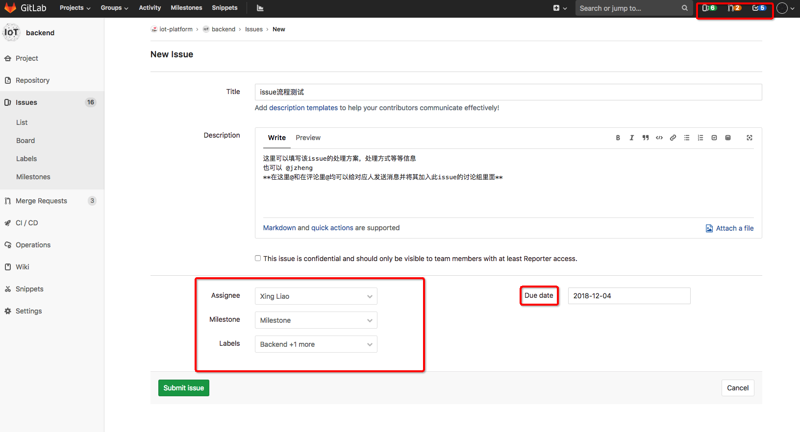

# 项目开发流程规范

## 一、issue 管理规范

1. 迭代开始前定好相关任务后，个人根据任务情况建立细化的任务 issue，issue 的处理时间一般不超过一天。
2. 创建 issue 后定义好 issue 的责任人、Labels 和 Due date。

3. label 的选择：必须选择一个以下的 label 标明  此 issue 所属部分

   - a - Frontend (前端)
   - b - MP (小程序、公众号)
   - c - Backend (后端)
   - d - UX (需求分析、文档)
   - e - infrastructure (基础设施)

4. 可以根据情况自定义添加其他的 label 到 issue 里面，比如所属系统、模块、技术栈等。
5. label 一般不超过 3 个。
6. 每天早会前 check 所有 issue 是否有更新，或者是否忘记更新。

## 二、代码分支规范

1. 一个项目的代码目前包含三个被保护分支：`master`,`pre`,`dev`

   - `master`: 该分支为项目主分支，对应正式环境的运行版本
   - `pre`: 该分支为项目主分支，对应预上线环境的运行版本
   - `dev`: 该分支为开发快照版本的分支，对应开发环境的运行版本,允许所有开发人员  将开发分支代码 merge 到此分支(在 gitlab 网页进行操作)

2. 所有人均不允许直接向保护分支 push 代码。
3. 每一个 issue 的开发均需要建立独立的分支(此分支从 pre 分离)，常规情况下一个分支的保留时间不超过 3 天。

## 三、代码提交规范

1. 当一个 issue 基本开发完成的时候，将代码 push 到对应分支，在 gitlab 网页中`提交merge request到dev分支`，并 Accept Merge Request （`此处可自行进行merge`），会触发开发环境服务器更新。
2. 当 issue 在开发环境测试完成，从开发分支`提交merge request到pre分支`,并指定对应项目负责人进行 merge。

3. 负责人 review 代码，如果代码有错误或者不规范则在 issue 上评论，提交人及时更改后再做合并。
4. 代码合并到 pre 后及时删除对应分支。

## 四、流程总体示意图

