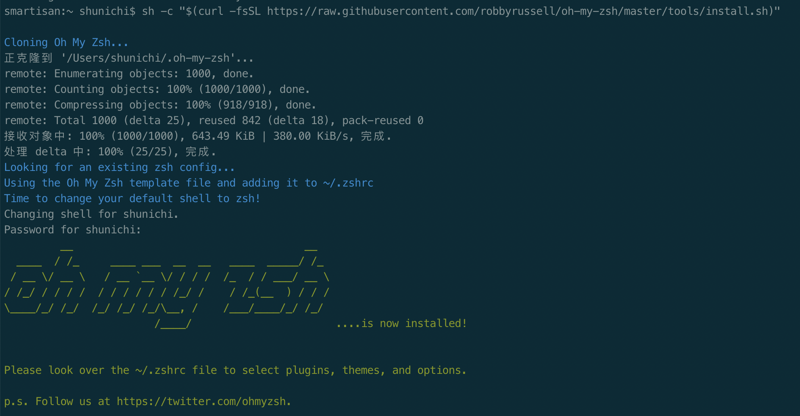

### 快速安装

国内:

```shell
sh -c "$(curl -fsSL https://code.aliyun.com/kar/ohmyiterm2/raw/master/install.sh)" "" aliyun
```

国外:

```shell
sh -c "$(curl -fsSL https://raw.githubusercontent.com/KingFalse/ohmyiterm2/master/install.sh)" "" github
```

### 下载 `iTerm2`

用户可以直接去[官网](https://www.iterm2.com/)下载。安装完成后，在 `/bin` 目录下会多出一个 `zsh` 的文件。

### 安装 `Oh-My-Zsh`

安装方法有两种，可以使用`curl`或`wget`，看自己环境或喜好。

```shell
# curl 安装方式
sh -c "$(curl -fsSL https://raw.githubusercontent.com/robbyrussell/oh-my-zsh/master/tools/install.sh)"
```

```shell
# wget 安装方式
sh -c "$(wget https://raw.githubusercontent.com/robbyrussell/oh-my-zsh/master/tools/install.sh -O -)"
```

安装命令和安装完成后的截图：



### 安装 `PowerLine`

点击查看 [PowerLine](https://powerline.readthedocs.io/en/latest/installation.html)

安装 `powerline` 的方式依然简单，也只需要一条命令：

```shell
pip install powerline-status --user
```

没有安装 `pip` 的同学可能会碰到 `zsh: command not found: pip`


使用命令安装 `pip`即可：

```shell
sudo easy_install pip
```


安装后再次执行安装 powerline 的命令即可：


### 安装 `PowerFonts`

安装字体库需要首先将项目 `git clone` 至本地，然后执行源码中的 `install.sh`

在你习惯的位置新建一个文件夹，如在桌面建立一个名叫 `OpenSource` 的文件夹，在此文件夹下执行 `git clone` 命令：

```shell
# 进入 OpenSource 文件夹
cd ~/Desktop/OpenSource
# git 克隆
git clone https://github.com/powerline/fonts.git --depth=1
# 进入 fonts
cd fonts
# 执行 install shell
./install.sh
```

执行结果如下：


安装好字体库之后，我们来设置`iTerm2`的字体，具体的操作是`iTerm2` -> `Preferences` -> `Profiles` -> `Text`，在`Font`区域选中`Change Font`，然后找到`Meslo LG`字体。有`L`、`M`、`S`可选，看个人喜好：


### 安装配色方案

再次进入`iTerm2` -> `Preferences` -> `Profiles` -> `Colors` -> `Color Presets`中根据个人喜好选择这两种配色中的一种即可，这里我们推荐`Solarized Dark` 或者 `Solarized Light`。


### 安装、选择主题

将 `.zshrc` 文件中的 `ZSH_THEME` 后面的字段改为 `agnoster` 。

```shell
vi ~/.zshrc
```


修改完成后按一下`esc`调出`vi`命令，输入`:wq`保存并退出`vi`模式。

此时`command+Q`或`source`配置文件后，`iTerm2`变了模样。

### 安装高亮插件

这是`oh my zsh`的一个插件，安装方式与`theme`大同小异：

```shell
cd ~/.oh-my-zsh/custom/plugins/
git clone https://github.com/zsh-users/zsh-syntax-highlighting.git
vi ~/.zshrc
```


这时我们再次打开`.zshrc`文件进行编辑。找到`plugins`字段，此时`plugins`中应该已经有了`git`，我们需要把高亮插件也加上：


**请务必保证插件顺序， `zsh-syntax-highlighting` 必须在最后一个。**

然后在文件的最后一行添加：`source ~/.oh-my-zsh/custom/plugins/zsh-syntax-highlighting/zsh-syntax-highlighting.zsh`


按一下`esc`调出`vi`命令，输入`:wq`保存并退出`vi`模式。

执行命令使刚才的修改生效：

```shell
source ~/.zshrc
```

### 可选择、命令补全

跟代码高亮的安装方式一样，这也是一个`zsh`的插件，叫做`zsh-autosuggestion`，用于命令建议和补全。

```shell
cd ~/.oh-my-zsh/custom/plugins/
git clone https://github.com/zsh-users/zsh-autosuggestions
vi ~/.zshrc
```

找到`plugins`，加上这个插件即可。


### 最终效果


